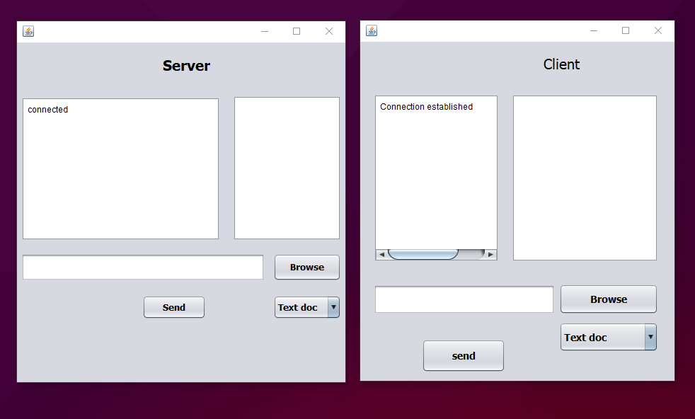
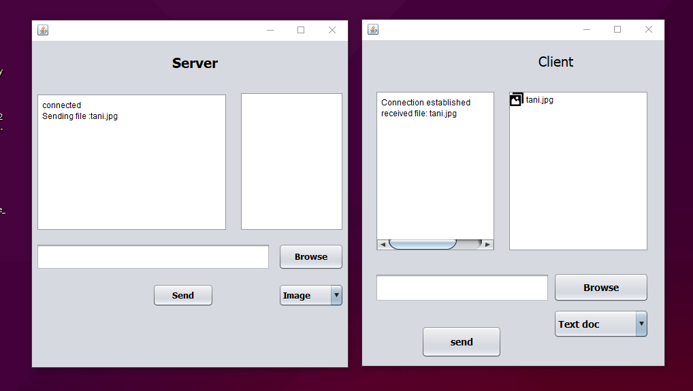
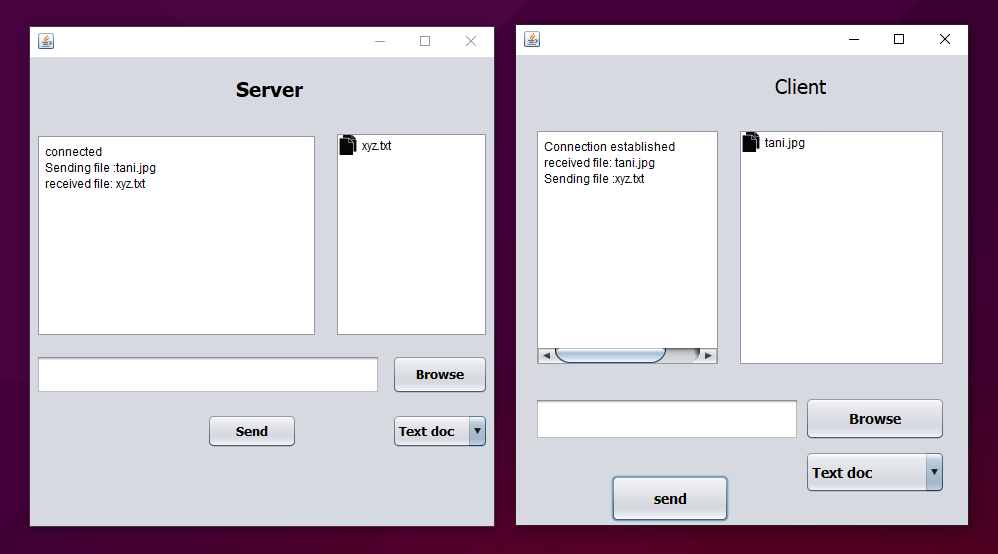

# ShareIt in Java

## What is ShareIt ?

```
1. ShareIt is a Client - Server Application.
2. An application which Shares Docs, pdfs ,files between them. 
3. This sharing application can be used by end user as sharing application to share the files over a network.
4. This application can only be used in desktop or laptops.
```

## Features in ShareIt

```
1. File transfer from Client to Server and vice-versa.
2. File format Supported : .jpg, .png, .pdf, .txt, .mp4, etc
3. Socket Programming is used so that two remote computers/hosts can share data properly.
```

## Software/Hardware Requirements

```
1. Operating System : windows 10
2. IDE : Brackets/notepad 
3. RAM : 4 GB
4. 2 GB Graphics card
```

## SnapShots Of Project

#### Connection Established


#### Server To Client Data Transfer


#### Client To Server Data Transfer

